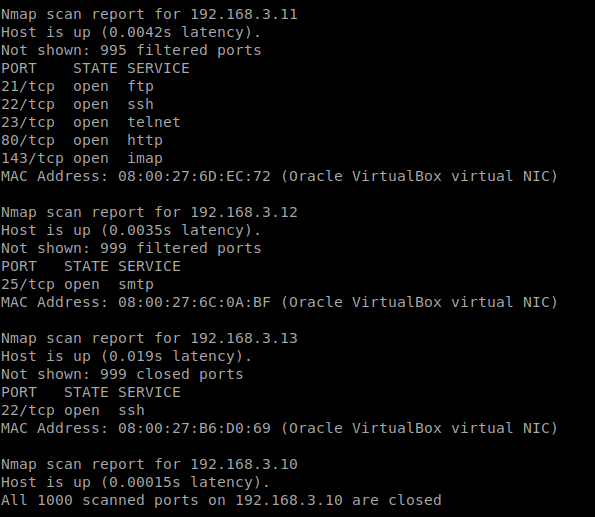
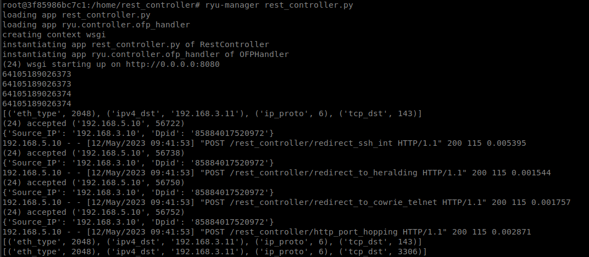
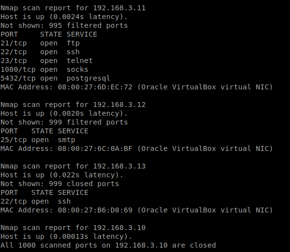
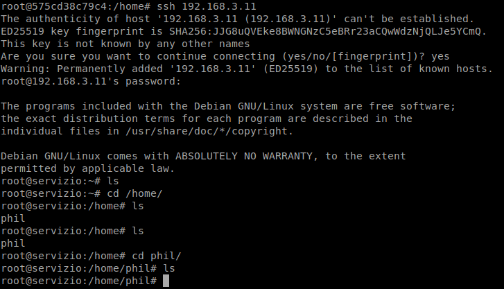
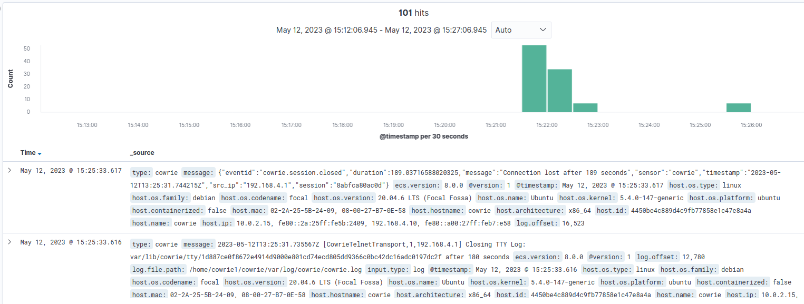

# Demo 1 - Private Subnet Scanning
> Attacker is considered already in *Private Subnet*. A TCP Connect Scan is carried out from attacker, with the aim to realize host discovery into the Subnet where he is located. Through this kind of scanning, the host establishes a full connection towards the target, by completing the TCP three-way handshake. 

## Access to Internal Host Machine and realize a first TCP Connect Scan
1. Enter in *int_host* Docker Container.
```  
$ docker exec -it int_host bash
```
2. From *int_host* realize a **TCP Connect Scan** in *Private subnet*.
```  
$ nmap -sT 192.168.3.0/24
```
## Results
> As a result, all the subnet hosts with related services are discovered. They are: **Internal Server** (*192.168.3.11*), **Internal Heralding** (*192.168.3.12*), **Internal SSH Server** (*192.168.3.13*).

 

> Since a connection has been established also with internal decoy services, this scanning activity can be easily detected, and the internal host is identified as malicious. After a while, the **MTD Redirection Rules** are dynamically inserted in the Internal **Open vSwitch**, via Controller’s API.



## Access to Internal Host Machine and realize a second TCP Connect Scan
3. Therefore, another scanning is performed, in order to notice **Reactive MTD Port Hopping** and **Proactive MTD Port Hopping**.
```  
$ nmap -sT 192.168.3.0/24
```



## Redirection
4. By contacting **Internal Server** on port 22 or 23, you will be redirected to **Cowrie Honeypot** in **Threat Intelligence Subnet**. On the other hand, if the request is made against **Internal Server** on port 21, destination honeypot is **Heralding Honeypot** in **Threat Intelligence Subnet**.
```  
$ ssh 192.168.3.11
```



## Log analysis
> **Cowrie** and **Heralding** Honeypots (in **Threat Intelligence Subnet**) logs are collected and analyzed via **ELK Stack**. 


5. To view these logs just type into your browser the following lines in order to access to **Kibana GUI**. Enter in *Discover* section and view *cowrie* or *new-heralding* logs. You can also access to customized dashboards via *Dashboard* section.
```  
http://192.168.5.10/24:5601 or http://192.168.11.10/24:5601
```


