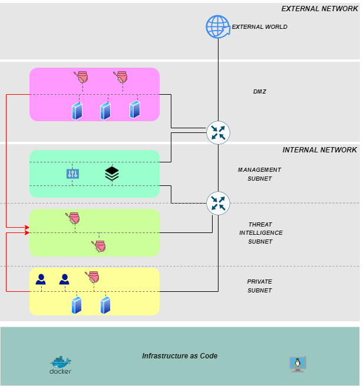

# A Software Defined approach to Moving Target Defense in the Internet - M.Sc. Thesis
> Project aim is to reach **Defensive Deception** by mixing **Moving Target Defense** techniques and **Active Deception** ones, in order to fill the gap between attackers and defenders. Project architecture leverages on **Software Defined Networking (SDN)** paradigm, with the aim to facilitate the implementation of those novel security protection strategies. SDN has been created via two **Open vSwitches** and a **Ryu Controller**. Network hosts have been configured using both **Docker Containers** and **Virtual Machines**. ​

## Topology


## Installation
### Prerequirements  
In order to execute the project on your machine
you need to install *Open vSwitch*, *Vagrant*, *Virtualbox*, *Docker* and *Docker Compose*.

The following steps allow project running on a Linux *(Ubuntu 20.04)* machine.

### Setup
In `topology` folder: 
1. Execute the script **create_net.sh**.
```  
$ ./create_net.sh
```
2. Execute the script **setup.sh**.
```  
$ ./setup.sh
```
Virtual Machines creation and configuration:

1. In `vagrant/ubuntu` folder run **vagrant up**.
```  
$ cd topology/vagrant/ubuntu
$ vagrant up
```
2. VM username = **vagrant**. VM password = **vagrant**.
3. Enter in *ext_heralding* VM (via VirtualBox Gui) and execute the script *"start.sh"* in `root` directory.
4. Enter in *int_heralding* VM and execute the script *"start.sh"* in `root` directory.

Containers building and setup:
1. In `docker/docker-build` folder run **docker compose up**.
```  
$ cd topology/docker/docker-build
$ docker compose up
```
2. In `docker` folder execute the script **setup_container.sh**.
```  
$ cd topology/docker
$ ./setup_container.sh
```
3. In `docker` folder execute the script **auth.sh**.
```  
$ cd topology/docker
$ ./auth.sh
```

## Execution
### Start Ryu Controller
1. Open a command line and execute *controller* Container:
```  
$ docker exec -it controller bash
```
2. In *controller* Container, enter in **/home/rest_controller** directory and run the following command:
```  
$ cd /home/rest_controller
$ ryu-manager rest_controller.py
```

### Launch Elastalert
1. Enter in *ELK* Virtual Machine (via VirtualBox GUI) with username and password previously specified.
2. In *ELK* Virtual Machine, enter in **/elastalert** directory and run:
```  
$ cd elastalert
$ python3 -m elastalert.elastalert --verbose
```

Now it is possible to proceed with **Attack Scenarios** demonstrations. One of them is outlined in `DEMO.md`. Project evaluation is introduced in `README.md` file, in `evaluation` folder.

## Reset
1. In `/docker/docker-build` run **docker compose down**.
```  
$ cd topology/docker/docker-build
$ docker compose down
```
2. In `/vagrant/ubuntu` run **vagrant destroy**.
```  
$ cd topology/vagrant/ubuntu
$ vagrant destroy
```
3. In `topology` execute the script **reset.sh**.
```  
./reset.sh
```