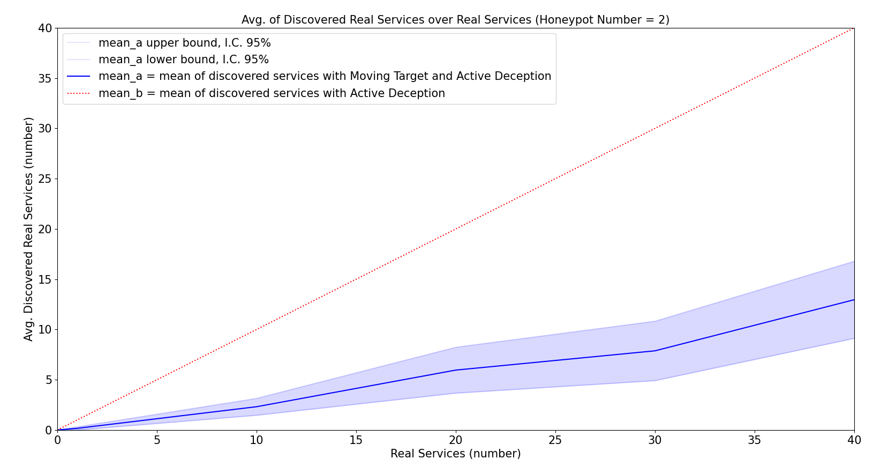
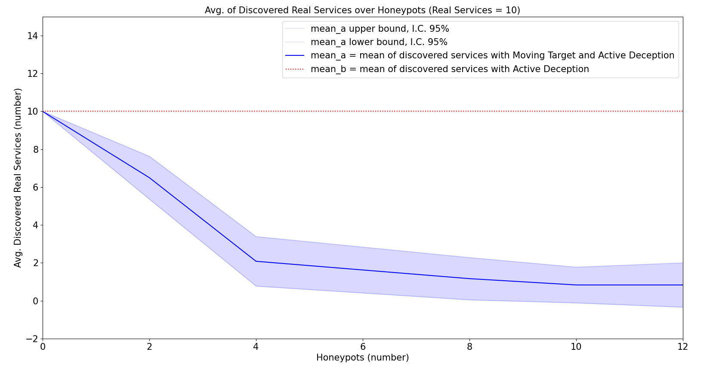

# A Software Defined approach to Moving Target Defense in the Internet - M.Sc. Thesis
## Evaluation
> A set of experiments realized in order to show Project effectiveness.

### Test Case 1
Average number of Discovered Real Services with Services increasing and a Constant Honeypot number (k = 2).
Tests have been carried out by realizing **TCP Connect Scan** in the subnet, from attacker host, and subnet hosts are processed one at a time, randomly. A service is considered discovered by attacker, if it is analyzed before the first scanned honeypot. Considered services number ranges from zero to forty.

### Test Case 2
Average number of Discovered Real Services, with Honeypots increasing and a Constant Service number (k = 10).
Tests have been carried out by realizing **TCP Connect Scan** in the subnet, from attacker host, and subnet hosts are processed one at a time, randomly. A service is considered discovered by attacker, if it is analyzed before the first scanned honeypot. Considered honeypots number ranges from zero to twelve.

